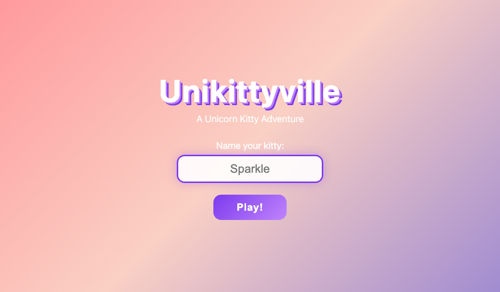
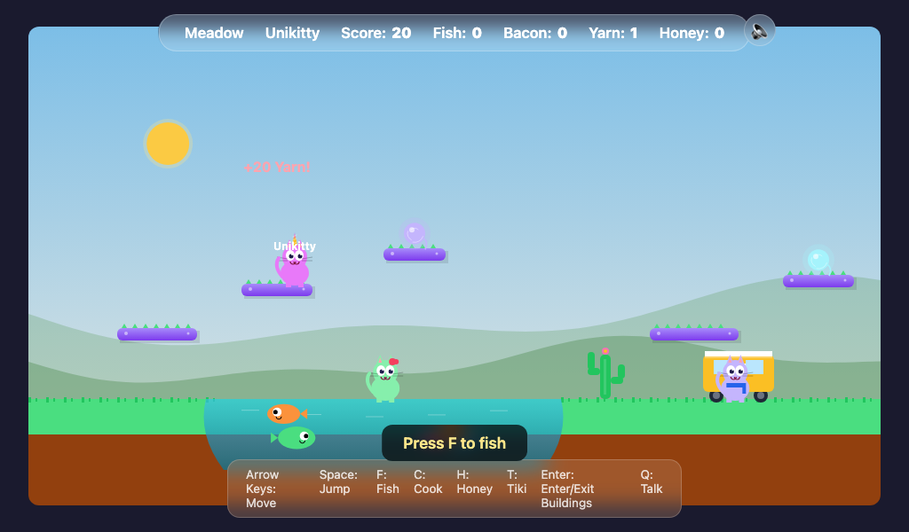
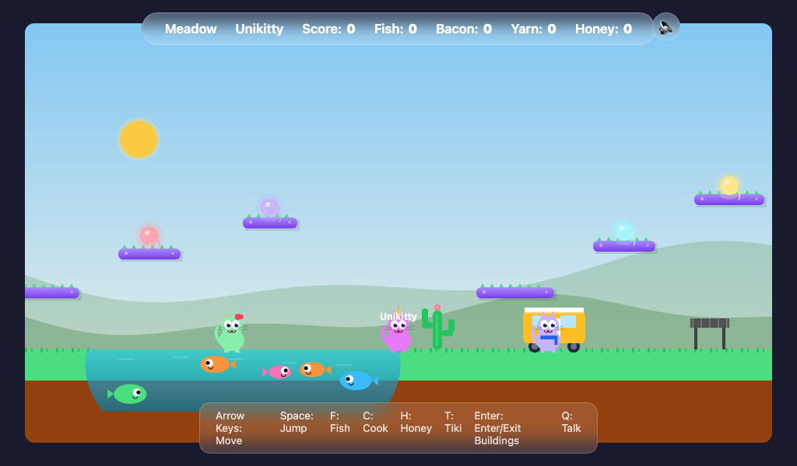
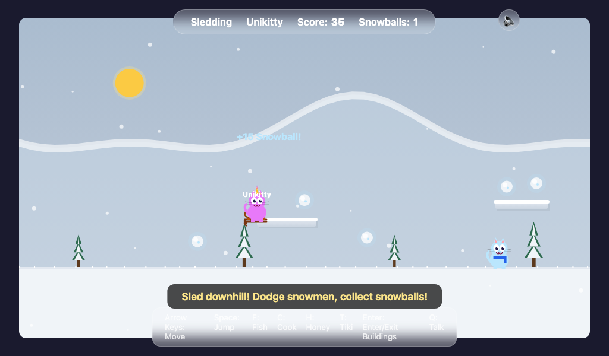
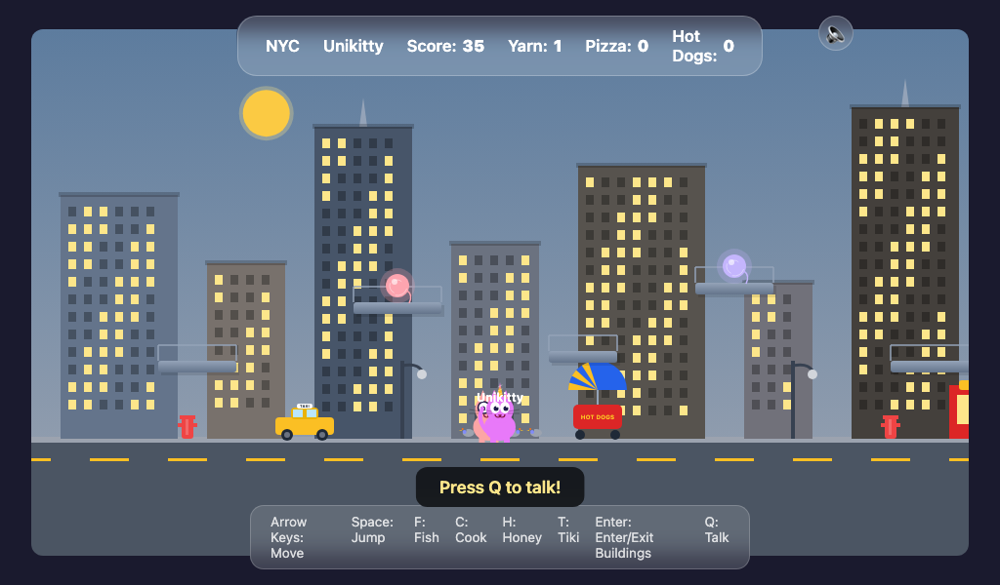
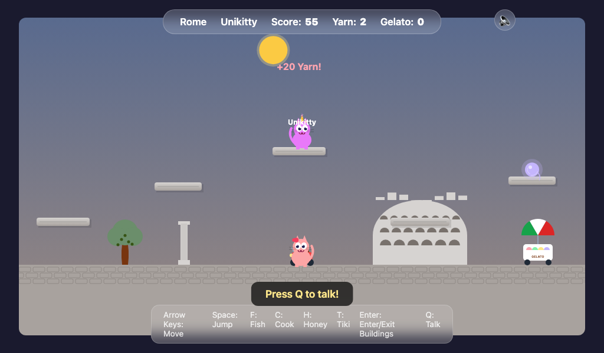
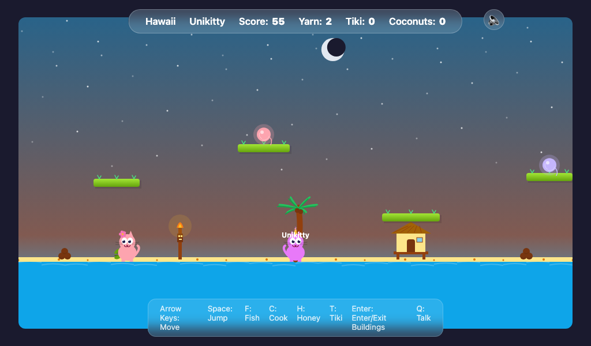
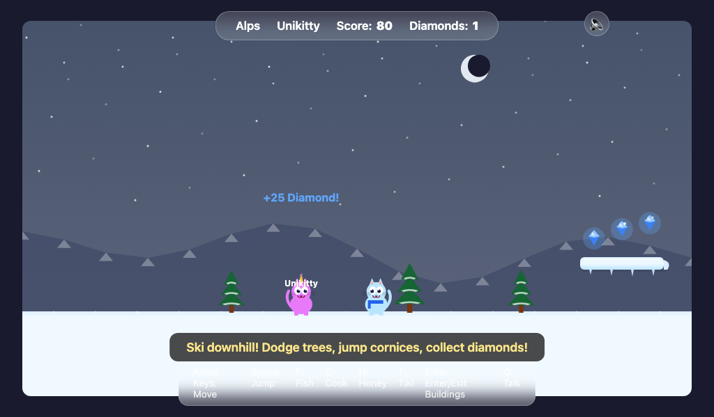

# Unikittyville

A browser-based 2D side-scrolling adventure where unicorn kitties explore the world, collect items, and play mini-games. Built entirely with HTML5 Canvas and vanilla JavaScript — no frameworks, no build tools, just one `index.html`.

**Play it now:** [norahtashner.com/games/unikittyville](https://norahtashner.com/games/unikittyville/)



## Levels

### Meadow

Fish in the pond, cook bacon on the grill, collect yarn balls from floating platforms, and visit the beehive for honey. A day/night cycle paints the sky as you explore.




### Sledding

Sled downhill through the snow, dodge snowmen, and collect snowballs. Catch the train at the end to head to the city.



### NYC

Explore the city skyline with skyscrapers, taxis, and fire escapes. Make pizza in the pizza shop, grab hot dogs from street vendors, and stroll through Central Park.



### Rome

Walk the cobblestone streets past the Colosseum and Pantheon. Splash in fountains, grab gelato, and catch a Fiat to your next destination.



### Hawaii

Hit the beach with tiki torches, coconut palms, and ocean waves. Light torches, collect coconuts, and surf the waves beneath a volcano.



### Alps

Ski downhill dodging pine trees, jump over cornices, and collect diamonds. Warm up in the chalet with a marshmallow-tossing mini-game.



## Controls

| Key | Action |
|-----|--------|
| Arrow Keys | Move |
| Space | Jump |
| Enter | Enter/exit buildings, portals, taxis |
| F | Fish (Meadow) |
| C | Cook / Make pizza / Collect coconuts |
| H | Collect honey (Meadow) |
| S | Swim / Surf |
| G | Buy gelato (Rome) |
| T | Light tiki torch (Hawaii) |
| Q | Talk to NPCs |

Touch controls with on-screen D-pad and action buttons are available on mobile devices.

## Running Locally

```bash
# Serve with any static server
python3 -m http.server 8080
# Open http://localhost:8080
```

Audio files (MP3) live in `assets/music/` and `assets/sfx/`. WAV source files are in `assets/*/source/` and are not needed to run the game.

## Architecture

- **Single file:** All HTML, CSS, and JavaScript in one `index.html`
- **Rendering:** HTML5 Canvas with `requestAnimationFrame` game loop
- **Graphics:** Everything drawn with the Canvas API — no image assets
- **Audio:** MP3 files for background music (per-level tracks) and sound effects (meows, cha-ching)
- **Mobile:** Responsive canvas sizing, touch controls overlay, orientation detection
